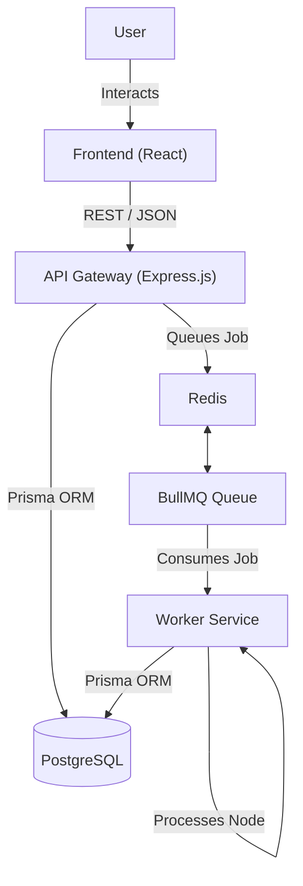
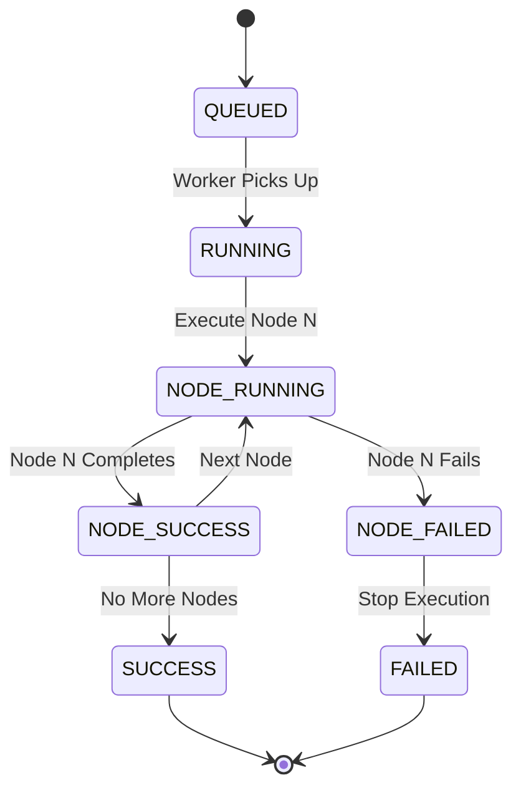
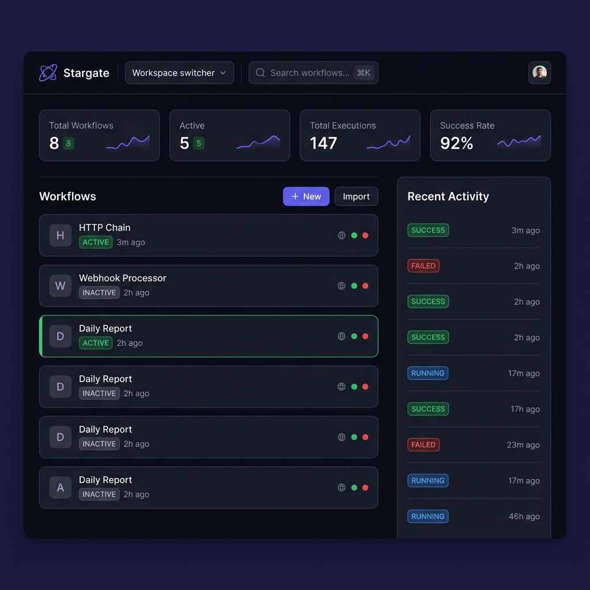
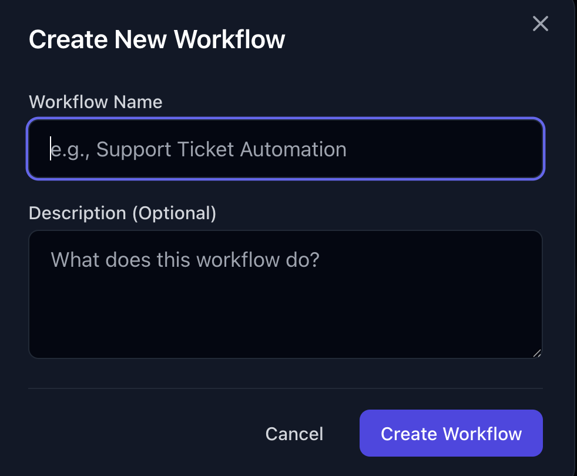
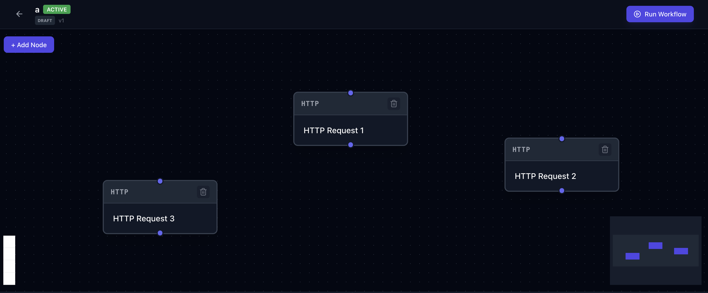
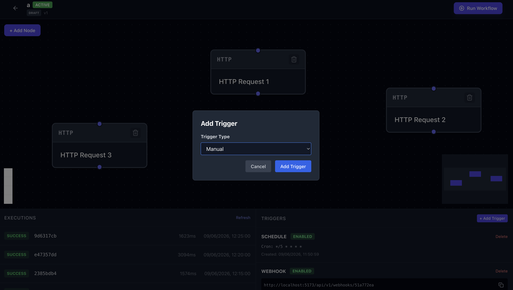
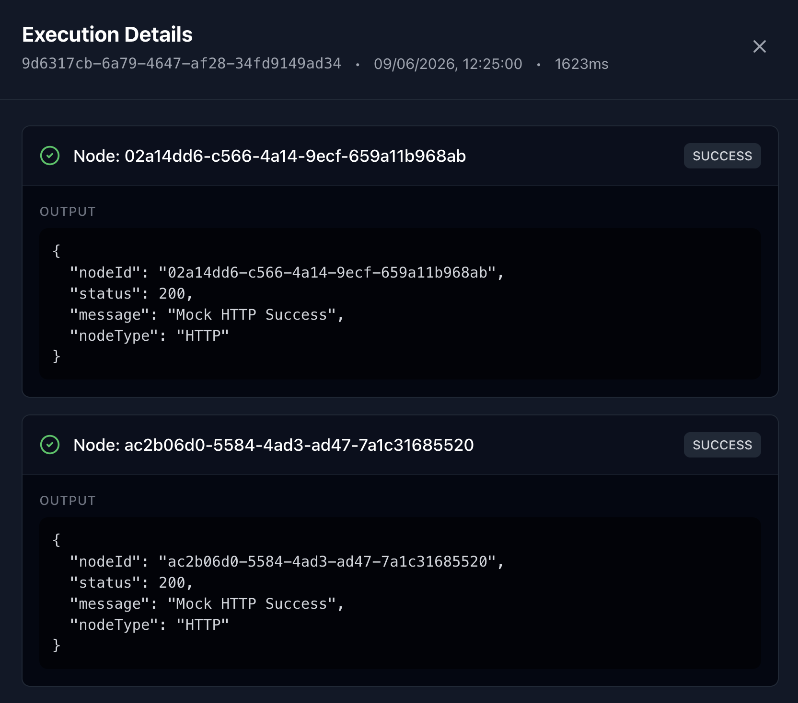
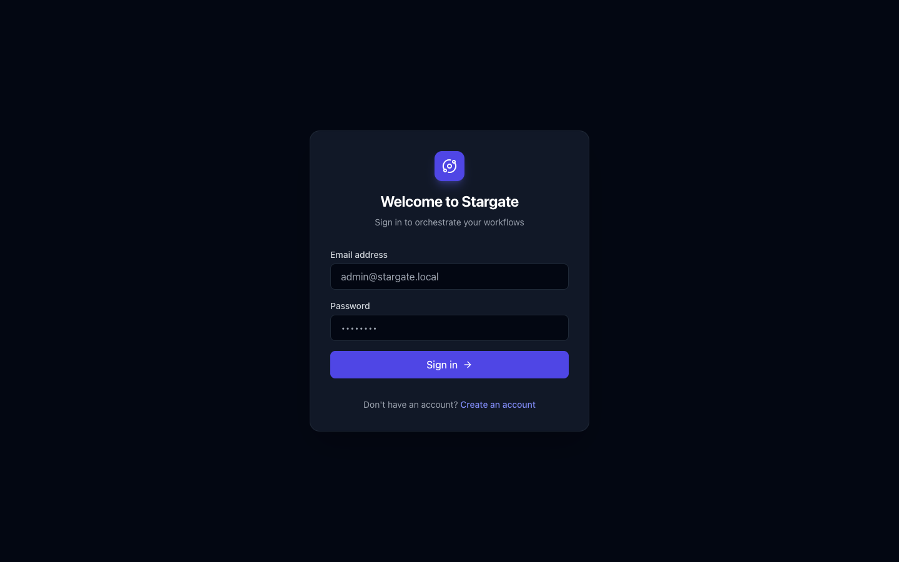

# Stargate

A workflow orchestration platform that enables users to create, execute, monitor, and automate workflow pipelines through a visual node-based canvas.

Inspired by workflow engines such as n8n, Temporal, Apache Airflow, and Node-RED.

---

## Overview

Stargate provides a clear abstraction over asynchronous execution logic, isolated workspaces, and persistent graphical states. It lets you construct complex automation pipelines visually, configure triggers, and monitor robust distributed background executions.

## Problem Statement

Modern automation systems require workflows consisting of multiple interconnected tasks. When scaling automation, defining workflows through code or basic configuration files becomes opaque, brittle, and difficult to monitor.

Many developers struggle to:
- Visualize workflow execution and data flow logic.
- Manage execution history to identify regressions or bottlenecks.
- Track node-level status when intermittent failures occur.
- Persist complex workflow structural relationships efficiently.
- Execute workflows reliably in a distributed environment.

StarGate addresses these problems through a visual workflow orchestration platform built with modern web technologies.

---

## Features

- **Multi-Workspace Architecture**: Securely isolate your workflows inside distinct workspaces.
- **Visual Node Editor**: Interactive React Flow-based canvas with drag-and-drop nodes and edge connections.
- **Automated Triggers**: Instantiate workflows manually, via webhooks, or automatically using Cron schedules.
- **Background Execution**: A highly scalable Redis + BullMQ asynchronous worker architecture prevents UI hanging.
- **Execution Tracking**: Monitor every single execution step (Queued, Running, Success, Failed) live through network polling.
- **Granular Details**: Inspect inputs, outputs, timestamps, and error traces for individual node operations.
- **Persistence**: ACID-compliant PostgreSQL backing for reliable persistence of nodes, edges, triggers, and execution histories.
- **Real HTTP Execution Engine**: Execute real outbound GET/POST/PUT/PATCH/DELETE network requests with custom headers, JSON bodies, and configurable execution timeouts natively powered by the background worker.

---

## Architecture



---

## Technology Stack

### Frontend
- **React**: Component-based UI.
- **TypeScript**: Static typing for structural reliability.
- **Zustand**: Lightweight, predictable global state management.
- **React Flow**: Interactive node-based canvas rendering.
- **TailwindCSS**: Utility-first styling for rapid prototyping.

### Backend
- **Node.js**: Asynchronous server runtime.
- **Express**: HTTP routing architecture.
- **Prisma**: Type-safe ORM mapped to PostgreSQL.
- **BullMQ**: Distributed queue system.
- **Redis**: In-memory message broker for scaling tasks.

### Infrastructure
- **PostgreSQL**: Robust, ACID-compliant relational database.
- **Docker & Docker Compose**: Containerization ensuring consistent local environments.
- **Turborepo**: High-performance monorepo build system.

---

## Workflow Lifecycle



---

## Trigger System

Workflows in Stargate operate on a dynamic, event-driven architecture mapping execution logic to external or internal events:

1. **Manual Triggers**: Directly execute workflows from the UI via the "Run Workflow" action.
2. **Webhook Triggers**: Generates unique API endpoints allowing external services to trigger pipelines with custom POST requests.
3. **Schedule Triggers**: Fully configurable Cron syntax (e.g., `*/5 * * * *`) that routinely fires background workflows automatically.

---

## Execution Engine & Redis + BullMQ Queue Architecture

Stargate moved from a synchronous local API executor to a completely asynchronous and highly scalable background processing infrastructure.

When a workflow runs, the `stargate-api-1` container generates a `WorkflowExecution` tracker and dispatches the required tasks as Jobs into a **Redis-backed BullMQ Queue**.

An independent `stargate-worker-1` container listens to the queue, consumes jobs iteratively, evaluates node processing, and sequentially logs structural state changes back to PostgreSQL without blocking the main event loop. This enables concurrent background scheduling, advanced retry policies, and true microservice autonomy.

---

## Screenshots

### Dashboard Overview


### Workflow Creation Modal


### Visual Workflow Canvas


### Trigger Management (Manual, Webhook, Schedule)


### Execution Details


### HTTP Node Configuration


### Real Execution Details


---

## Local Setup

1. **Clone the repository:**
   ```bash
   git clone https://github.com/Ayush-o1/StarGate.git
   cd StarGate
   ```

2. **Install dependencies:**
   ```bash
   pnpm install
   ```

3. **Start infrastructure via Docker:**
   ```bash
   docker-compose up -d --build
   ```
   This will spin up the `PostgreSQL`, `Redis`, `API`, `Worker`, and `Web` containers.

4. **Access the application:**
   - Web UI: http://localhost:5173
   - API: http://localhost:3000

---

## Project Structure

```text
stargate/
├── apps/
│   ├── api/            # Express.js backend (REST endpoints & Job Dispatcher)
│   ├── web/            # React.js frontend (Zustand & React Flow)
│   └── worker/         # BullMQ processing engine (Consumes Redis jobs)
├── packages/
│   ├── database/       # Prisma ORM, migrations, and schema design
│   ├── shared/         # Shared Zod validation schemas & typings
│   └── config/         # Eslint / TS configurations
├── docs/               # Visual and technical documentation
└── docker-compose.yml  # Local infrastructure blueprint
```

---

## Future Roadmap

- **Conditional Branching**: If/Else logic routing workflows dynamically based on node output.
- **Retry Policies**: Configurable exponential backoff on intermittent HTTP node failures.
- **Role-Based Permissions**: Granular Viewer/Editor abstractions inside workspaces.
- **Workflow Versioning**: Immutable workflow snapshots preventing disruption of active executions.
