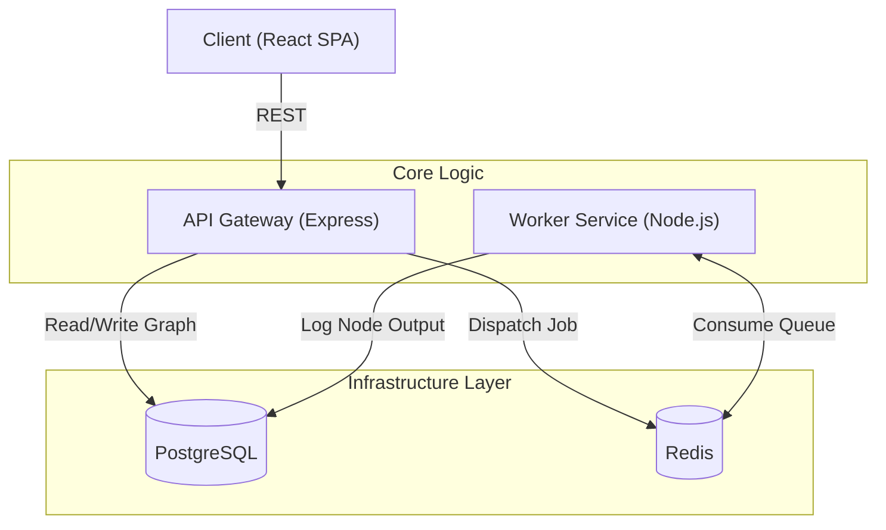
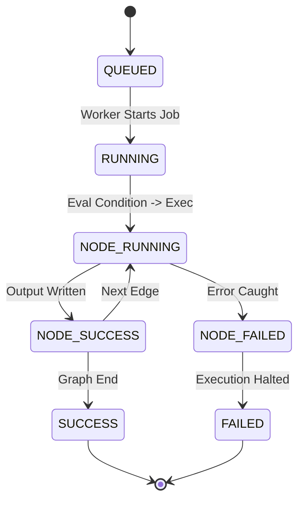

<div align="center">
  
</div>

# Stargate

[](https://opensource.org/licenses/MIT)
[](https://www.docker.com/)
[](https://reactjs.org/)
[](https://www.typescriptlang.org/)

A production-grade, distributed workflow orchestration platform. Stargate enables users to design, execute, monitor, and automate execution pipelines through an interactive, node-based visual canvas.

Inspired by industry standards such as **n8n**, **Temporal**, **Apache Airflow**, and **Node-RED**.

---

## 📖 Table of Contents
- [Problem Statement](#-problem-statement)
- [Key Features](#-key-features)
- [Architecture & System Design](#-architecture--system-design)
- [Core Engines](#-core-engines)
- [Observability & Security](#-observability--security)
- [Tech Stack](#-tech-stack)
- [Local Development Setup](#-local-development-setup)
- [Project Structure](#-project-structure)
- [Future Roadmap](#-future-roadmap)

---

## 🎯 Problem Statement

Modern automation systems require executing complex sequences of interconnected tasks, often interacting with dozens of external APIs. Defining these pipelines through monolithic code or rigid configuration files becomes opaque, brittle, and difficult to monitor at scale.

Stargate solves these pain points by offering:
- **Visual Clarity:** A drag-and-drop DAG (Directed Acyclic Graph) editor mapping data flows intuitively.
- **Resilience:** A decoupled, asynchronous worker architecture ensuring that temporary failures don't crash the orchestrator.
- **Traceability:** Granular, node-level execution history with timestamps, inputs, and outputs safely stored in PostgreSQL.

---

## ✨ Key Features

- **Multi-Workspace Isolation:** Securely divide workflows into logical workspaces with RBAC boundaries.
- **Interactive Visual Builder:** React Flow-powered canvas with infinite panning, custom nodes, and edge connections.
- **Variable Mapping Engine:** Dynamically pass payloads natively from upstream nodes into downstream HTTP URLs, Headers, or Bodies using `{{node.body.id}}` interpolation.
- **Conditional Branching:** Construct complex logic routes utilizing `IF` nodes that dynamically evaluate state and prune unreachable branches.
- **Automated Triggers:** Fire workflows manually, via exposed Webhook endpoints, or automatically using standard Cron schedules.
- **Workflow Validation:** Strict pre-flight graph cyclic dependency and missing-link detection.
- **Import/Export System:** Seamlessly serialize entire workflows into JSON and port them across workspaces.
- **Real HTTP Engine:** Dispatch authentic `fetch()` requests asynchronously directly from the worker.

---

## 🏗 Architecture & System Design

Stargate implements a microservice-oriented design to guarantee non-blocking API behavior during high-throughput workflow execution.



For more in-depth technical blueprints, see our [Architecture Documentation](docs/architecture.md) and [Features Documentation](docs/features.md).

---

## ⚙️ Core Engines

### The Queue Architecture (Redis + BullMQ)
When a workflow triggers, the API creates a `WorkflowExecution` row and dispatches a lightweight Job to Redis. A horizontally scalable Worker pool listens for jobs, re-hydrates the execution context, and traces the DAG without exhausting the main API thread.

### The Execution Lifecycle


### Conditional Branching
`IF` nodes allow logic gating. Using an embedded expression evaluator, the worker checks statements like `response.status === 200`. Edges matching the condition proceed normally; mismatched branches recursively mark their children as `SKIPPED`.

### Variable Resolution Engine
The Worker maintains a live `ExecutionContext` containing prior node outputs. The built-in Variable Resolver recursively scans configurations and replaces markers like `{{trigger.payload.id}}` prior to triggering outbound HTTP networks.

---

## 🛡 Observability & Security

- **System Metrics & Dashboards:** View holistic success rates, average duration statistics, and failure analytics globally per workspace.
- **Execution Tracking:** Real-time visibility into exact execution durations, inputs, and stack-traces. Slow executions (>5000ms) are automatically flagged in the UI.
- **SSRF Hardening:** Strict worker-level validations prevent Server-Side Request Forgery against internal networks (`localhost`, `127.0.0.1`, etc.).
- **Boundary Limits:** Global 1MB payload restrictions and 5-minute maximum workflow execution limits ensure stability.

---

## 💻 Tech Stack

### Frontend
- **React 18** + **Vite**: Rapid component rendering.
- **Zustand**: Lightweight, predictable global state.
- **React Flow**: High-performance node visualizer.
- **TailwindCSS**: Elegant utility-first styling.

### Backend
- **Node.js** + **Express**: Fast HTTP routing gateway.
- **Prisma ORM**: Type-safe relational database management.
- **BullMQ**: Rock-solid distributed queue system.
- **Zod**: Runtime payload validation.

### Infrastructure
- **PostgreSQL**: ACID-compliant persistence layer.
- **Redis**: In-memory message broker.
- **Docker Compose**: Deterministic local spin-up.
- **Turborepo**: Monorepo orchestration.

---

## 🚀 Local Development Setup

### Prerequisites
- [Docker & Docker Compose](https://www.docker.com/)
- [Node.js 18+](https://nodejs.org/)
- [pnpm](https://pnpm.io/)

### Installation

1. **Clone the repository:**
   ```bash
   git clone https://github.com/Ayush-o1/StarGate.git
   cd StarGate
   ```

2. **Install monorepo dependencies:**
   ```bash
   pnpm install
   ```

3. **Configure Environment Variables:**
   ```bash
   cp .env.example .env
   # Ensure PORT=3000, DATABASE_URL, REDIS_URL, and JWT_SECRET are set.
   ```

4. **Start the Infrastructure (DB, Redis, API, Worker, Web):**
   ```bash
   docker compose up -d --build
   ```

5. **Access Stargate:**
   - **Frontend UI:** [http://localhost:5173](http://localhost:5173)
   - **API Gateway:** [http://localhost:3000/api/v1](http://localhost:3000/api/v1)

---

## 📁 Project Structure

```text
stargate/
├── apps/
│   ├── api/            # Express Gateway (REST, Triggers, Job Dispatcher)
│   ├── web/            # React Frontend (Zustand, React Flow, Auth)
│   └── worker/         # Background Processing Engine (BullMQ Consumer)
├── packages/
│   ├── database/       # Prisma ORM & PostgreSQL Migrations
│   ├── shared/         # Zod schemas, TypeScript Interfaces
│   └── config/         # Shared Eslint / TypeScript settings
├── docs/               # System Architecture and API Documentation
└── docker-compose.yml  # Container orchestration blueprint
```

---

## 🛣 Future Roadmap

- **Retry Policies:** Implement granular, node-level exponential backoff algorithms for intermittent network errors.
- **Role-Based Workspaces:** Differentiate Viewer, Editor, and Admin permissions inside specific workspaces.
- **Workflow Versioning:** Maintain immutable graphical snapshots to prevent destructive mid-flight edits.
- **Native Integrations:** OAuth2 integrations with common SaaS providers (Slack, Stripe, Jira).

<div align="center">
  <sub>Built for precision, scalability, and developer experience.</sub>
</div>
