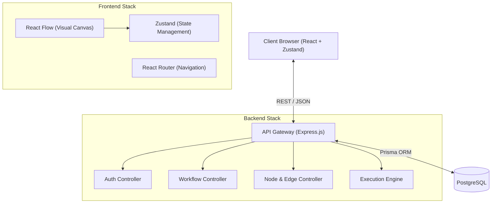
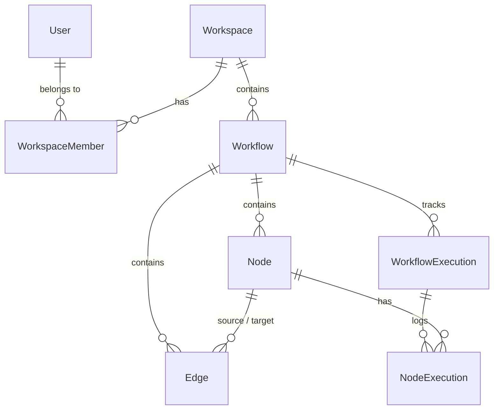
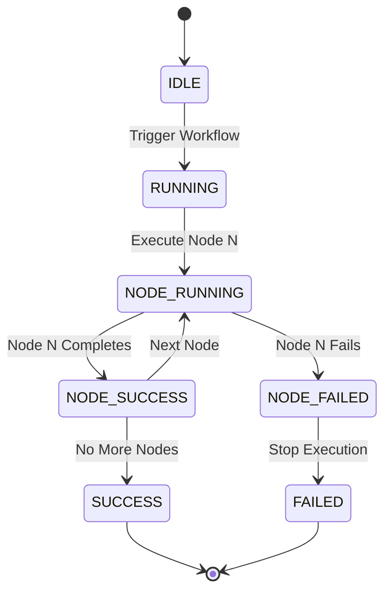
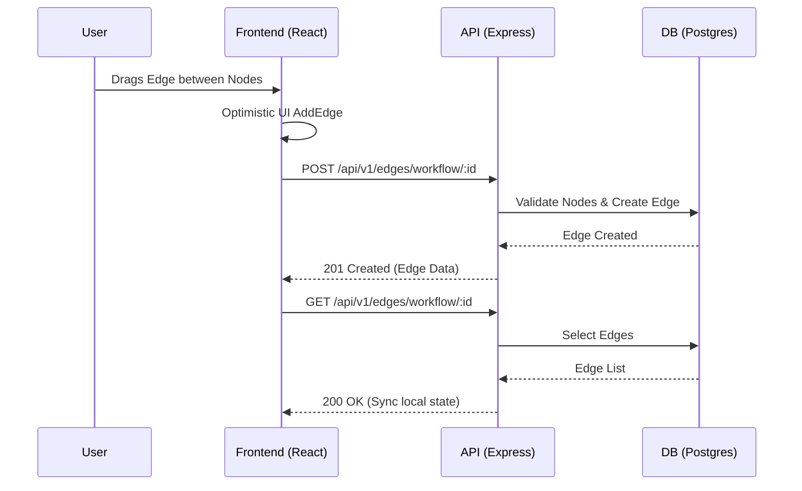
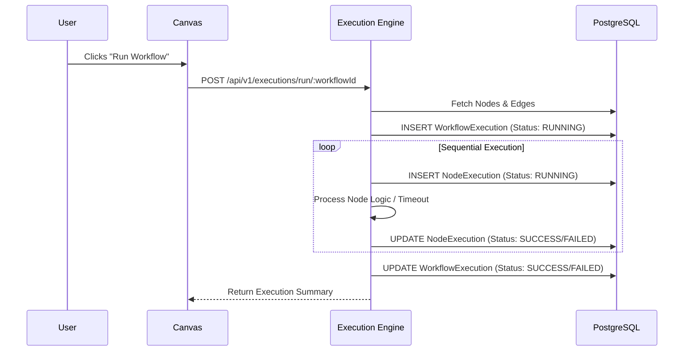

# StarGate

Visual Workflow Orchestration Platform

A workflow orchestration system that allows users to design, execute, and monitor automated workflows through a visual node-based editor.

Inspired by workflow engines such as n8n, Temporal, Apache Airflow, and Node-RED.

---

## Problem Statement

Modern automation systems require workflows consisting of multiple interconnected tasks. When scaling automation, defining workflows through code or basic configuration files becomes opaque, brittle, and difficult to monitor.

Many developers struggle to:
- Visualize workflow execution and data flow logic.
- Manage execution history to identify regressions or bottlenecks.
- Track node-level status when intermittent failures occur.
- Persist complex workflow structural relationships efficiently.
- Execute workflows reliably in a deterministic order.

StarGate addresses these problems through a visual workflow orchestration platform built with modern web technologies, providing a clear abstraction over asynchronous execution logic, isolated workspaces, and persistent graphical states.

---

## Core Features

### Authentication
- User registration and login flows.
- JWT-based stateless authentication.
- Secure, HTTP-only cookie-like token storage principles and salted bcrypt hashing.

### Workspace Management
- Multi-workspace support mapping users to isolated data boundaries.
- Seamless workspace switching without full-page reloads.
- Workspace ownership, maintaining structural roles and membership records.

### Workflow Management
- CRUD capabilities for structural workflows.
- Modular workflow versions and active statuses.
- Workspace-isolated execution tracking.

### Visual Workflow Builder
- React Flow-driven interactive canvas.
- Drag-and-drop nodes with smooth interpolation.
- Edge connections managing Directed Acyclic Graph (DAG) logic.
- Optimistic UI updates and persistent node coordinates via debounced backend synchronization.

### Execution Engine
- Workflow execution tracking with deterministic sequencing.
- Node execution tracking recording independent input/output contexts and granular execution states (e.g., `RUNNING`, `SUCCESS`, `FAILED`).
- Execution history with timestamp profiling.
- Runtime metrics measuring microsecond-level duration constraints.

### Persistence
- PostgreSQL storage guaranteeing ACID compliance.
- Prisma ORM providing strictly-typed database synchronization.
- Real-time workflow graph position persistence.
- Cascading deletion rules (Node deletion automatically pruning associated Edges).

---

## System Architecture

### High Level Architecture



### Database Relationships



### Workflow Execution Lifecycle



### Request Flow



---

## Database Design

The relational structure is explicitly typed via Prisma models:

### User
**Purpose**: Central identity entity. Stores authentication credentials and enables relationships to workspaces.

### Workspace
**Purpose**: Data isolation boundary. Encapsulates workflows ensuring multi-tenant capabilities.

### WorkspaceMember
**Purpose**: Join table linking `User` and `Workspace`. Contains role abstractions for future RBAC features.

### Workflow
**Purpose**: Defines a logical orchestration sequence. Tracks versioning, status, and binds nodes/edges together.

### Node
**Purpose**: Represents an isolated task (e.g., HTTP request, Script) within a workflow. Maintains positional data (`positionX`, `positionY`) for React Flow rendering.

### Edge
**Purpose**: Defines the directed execution path between two `Node` entities.

### WorkflowExecution
**Purpose**: Records the invocation lifecycle of a workflow. Tracks start time, end time, total duration, and global completion status.

### NodeExecution
**Purpose**: Records individual task progress within a `WorkflowExecution`. Crucial for granular debugging, storing `input`, `output`, and `error` traces.

---

## Workflow Execution Flow



---

## API Design

The API strictly adheres to REST principles using JSON payloads and JWT Bearer token authentication.

### Authentication
- `POST /api/v1/auth/register` - Registers a new user.
- `POST /api/v1/auth/login` - Authenticates user and returns JWT.

### Workspaces
- `POST /api/v1/workspaces` - Creates a new workspace and assigns the user as OWNER.
- `GET /api/v1/workspaces` - Lists all workspaces for the authenticated user.

### Workflows
- `POST /api/v1/workflows/workspace/:workspaceId` - Creates a workflow inside a workspace.
- `GET /api/v1/workflows/workspace/:workspaceId` - Lists workflows.
- `GET /api/v1/workflows/:id` - Retrieves a specific workflow.
- `DELETE /api/v1/workflows/:id` - Deletes a workflow.

### Nodes
- `POST /api/v1/nodes/workflow/:workflowId` - Creates a new node.
- `GET /api/v1/nodes/workflow/:workflowId` - Lists all nodes.
- `PUT /api/v1/nodes/:id/position` - Updates X/Y graphical coordinates.
- `DELETE /api/v1/nodes/:id` - Drops a node.

### Edges
- `POST /api/v1/edges/workflow/:workflowId` - Connects a source and target node.
- `GET /api/v1/edges/workflow/:workflowId` - Lists all edges.
- `DELETE /api/v1/edges/:id` - Deletes an edge.

### Executions
- `POST /api/v1/executions/run/:workflowId` - Triggers the sequential execution engine.
- `GET /api/v1/executions/workflow/:workflowId` - Retrieves execution history logs.

---

## Technology Stack

### Frontend
- **React**: Component-based UI.
- **TypeScript**: Static typing for structural reliability.
- **Zustand**: Lightweight, predictable global state management.
- **React Flow**: Interactive node-based canvas rendering.
- **TailwindCSS**: Utility-first styling for rapid prototyping.

### Backend
- **Node.js**: Asynchronous server runtime.
- **Express**: HTTP routing architecture.
- **Prisma**: Type-safe ORM mapped to PostgreSQL.

### Database
- **PostgreSQL**: Robust, ACID-compliant relational database.

### Infrastructure
- **Docker**: Containerization ensuring consistent environments.
- **Docker Compose**: Orchestration for local development linking API, Web, and Database.

---

## Engineering Decisions

- **Why PostgreSQL**: A relational model perfectly maps the structured hierarchy of Workspaces, Workflows, Nodes, and Edges. Referential integrity guarantees that deleting a node cascades cleanly to its edges.
- **Why Prisma**: Provides end-to-end type safety between the database schema and the Express controllers, preventing runtime mapping errors.
- **Why React Flow**: Built specifically for graph visualization, providing out-of-the-box support for pan, zoom, mini-maps, and custom node injection without rewriting canvas primitives.
- **Why Zustand**: Avoids the heavy boilerplate of Redux while effectively detaching business logic (API fetching) from React components.
- **Why Docker**: Ensures "it works on my machine" translates to reliable reproduction of the application architecture, managing database networking natively.
- **Why execution tracking tables exist**: Without `WorkflowExecution` and `NodeExecution` tables, workflows act as black boxes. Persisting states enables historical audits, resumption of failed queues, and granular performance analysis.

---

## Project Structure

```text
stargate/
├── apps/
│   ├── api/            # Express.js backend
│   │   ├── src/
│   │   │   ├── controllers/  # Request handling and business logic
│   │   │   ├── middleware/   # Express middlewares (Auth/Validation)
│   │   │   └── routes/       # Express route definitions
│   └── web/            # React.js frontend
│       ├── src/
│       │   ├── components/   # Reusable UI components (CustomNode)
│       │   ├── pages/        # Route-level views (Dashboard, Canvas)
│       │   └── store/        # Zustand state managers
├── packages/
│   ├── database/       # Prisma schema, migrations, and ORM client
│   └── shared/         # Zod validation schemas and shared TypeScript types
└── docker-compose.yml  # Local infrastructure definitions
```

---

## Challenges Solved

- **Workflow Graph Persistence**: Converting floating visual canvas data into strict database records. Solved by mapping React Flow `Nodes` to PostgreSQL `Node` records utilizing explicitly bound UUIDs.
- **Position Synchronization**: Frequent node dragging can flood APIs. Solved by utilizing React Flow's `onNodeDragStop` event rather than tracking continuous `onNodeDrag` mouse movements, minimizing database writes.
- **Execution Tracking**: Synchronizing a visual node to an asynchronous server action. Solved by sequentially inserting `NodeExecution` records dynamically tied to a parent `WorkflowExecution` session.
- **Workspace Isolation**: Ensuring users only interact with their own data. Solved via a relational verification layer in controllers that checks `WorkspaceMember` authorization bindings before mutating `Workflow` objects.
- **State Persistence After Refresh**: Solved by implementing optimistic UI rendering locally through Zustand while asynchronously validating requests against the backend to keep React Flow explicitly coupled to source-of-truth database records.

---

## Screenshots

Visual documentation of the application interface is available in the `docs/screenshots` directory.

- `dashboard.png`: Displays workspace management and workflow listing.
- `workflow_canvas.png`: Demonstrates the React Flow interactive node interface.
- `execution_history.png`: Displays granular execution tracking summaries.

*(Ensure you place the respective screenshots within the `docs/screenshots` directory.)*

---

## Future Roadmap

### Phase 7+
- **Conditional Branching**: If/Else logic routing workflows dynamically based on node output.
- **Webhook Triggers**: External HTTP ingress to instantiate executions.
- **Scheduling**: Cron-based invocation mapping.
- **Retry Policies**: Configurable exponential backoff on intermittent HTTP node failures.
- **Node Configuration Panels**: Dynamic property editing for custom node arguments.
- **Real HTTP Execution**: Node logic that invokes active external network requests.
- **Execution Logs**: STDOUT/STDERR capturing attached to NodeExecutions.
- **Role-Based Permissions**: Granular Viewer/Editor abstractions inside workspaces.
- **Workflow Versioning**: Immutable workflow snapshots preventing disruption of active executions.

---

## Key Engineering Achievements

- Architected a highly decoupled monorepo leveraging Turborepo to share types between a React frontend and an Express backend.
- Developed an interactive DAG (Directed Acyclic Graph) editor using React Flow with sub-second database synchronization.
- Designed a normalized PostgreSQL schema managing multi-tenant workspace environments with cascading relational integrity.
- Built a deterministic execution engine capable of logging granular node-level state transitions and profiling execution times.
- Implemented optimistic UI rendering logic to minimize perceived network latency during graph manipulation.
