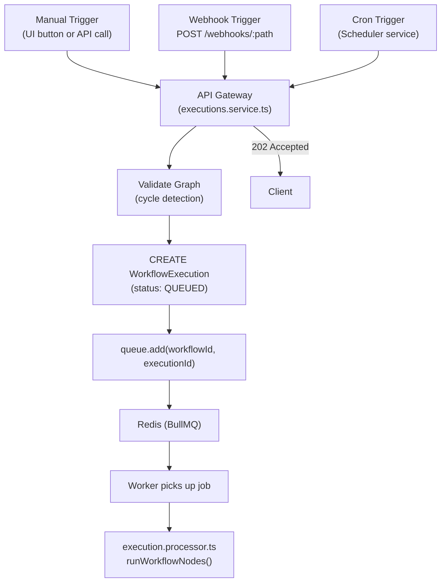

# Stargate Execution Engine

> Deep-dive into the workflow execution processor, DAG traversal, and node execution internals.

---

## Table of Contents

- [Overview](#overview)
- [Execution Trigger Flow](#execution-trigger-flow)
- [Worker Initialization](#worker-initialization)
- [DAG Traversal Engine](#dag-traversal-engine)
- [Node Execution Types](#node-execution-types)
- [Variable Resolution](#variable-resolution)
- [Conditional Branching](#conditional-branching)
- [Error Handling & Recovery](#error-handling--recovery)
- [Execution State Reference](#execution-state-reference)
- [Performance Characteristics](#performance-characteristics)

---

## Overview

The Stargate Execution Engine is a **BullMQ-backed distributed worker** that consumes workflow execution jobs from a Redis queue. It implements a full DAG execution pipeline including topological sorting, variable interpolation, conditional branching, and real HTTP request dispatch — all with per-node observability.

**Key files:**
- `apps/worker/src/worker.ts` — BullMQ worker initialization, job lifecycle
- `apps/worker/src/execution.processor.ts` — Core DAG traversal and node execution
- `apps/worker/src/utils/resolver.ts` — Variable interpolation engine
- `apps/worker/src/utils/ssrf.ts` — SSRF protection validator

---

## Execution Trigger Flow

A workflow execution begins when any of three trigger types fires:



---

## Worker Initialization

The worker connects to Redis using `ioredis` and initializes a BullMQ `Worker` instance bound to the `workflow-execution` queue:

```typescript
const worker = new Worker<ExecuteWorkflowPayload>(
  'workflow-execution',
  async (job: Job<ExecuteWorkflowPayload>) => {
    const { workflowId, executionId, triggerExecutionId } = job.data;
    
    // Mark execution as RUNNING
    await prisma.workflowExecution.update({
      where: { id: executionId },
      data: { status: 'RUNNING', retryCount: job.attemptsMade },
    });
    
    // Fetch workflow graph from DB
    const workflow = await prisma.workflow.findUnique({
      where: { id: workflowId },
      include: { nodes: { orderBy: { createdAt: 'asc' } }, edges: true },
    });

    // Execute with 5-minute global timeout
    const WORKFLOW_TIMEOUT_MS = 5 * 60 * 1000;
    await Promise.race([
      runWorkflowNodes(executionId, workflow.nodes, workflow.edges),
      new Promise((_, reject) => setTimeout(() => reject(new Error('Timeout')), WORKFLOW_TIMEOUT_MS))
    ]);
  },
  { connection: redisConnection }
);
```

### Retry Configuration
BullMQ handles up to **3 automatic retries** with exponential backoff if the job throws. Each retry increments `retryCount` on the `WorkflowExecution` record.

---

## DAG Traversal Engine

### Step 1: Build the Graph Representation

```typescript
// In-degree map: how many incoming edges does each node have?
const inDegree = new Map<string, number>();
// Adjacency list: what edges leave each node?
const adj = new Map<string, Edge[]>();

for (const node of nodes) {
  inDegree.set(node.id, 0);
  adj.set(node.id, []);
}

for (const edge of edges) {
  inDegree.set(edge.targetNodeId, (inDegree.get(edge.targetNodeId) || 0) + 1);
  adj.get(edge.sourceNodeId)!.push(edge);
}
```

### Step 2: Topological Sort (Kahn's Algorithm)

```typescript
const sorted: string[] = [];
const queue: string[] = [];

// Start with all nodes that have no dependencies
for (const [id, degree] of inDegree.entries()) {
  if (degree === 0) queue.push(id);
}

while (queue.length > 0) {
  const nodeId = queue.shift()!;
  sorted.push(nodeId);
  
  for (const edge of adj.get(nodeId) || []) {
    const newDegree = inDegree.get(edge.targetNodeId)! - 1;
    inDegree.set(edge.targetNodeId, newDegree);
    if (newDegree === 0) queue.push(edge.targetNodeId);
  }
}

// Sanity check: if sorted length != nodes length, there's a cycle
if (sorted.length !== nodes.length) {
  throw new Error('Cycle detected in workflow DAG');
}
```

### Step 3: Execute in Topological Order

For each node in the sorted order, the engine:
1. Checks `shouldExecute` based on incoming edge states
2. Creates a `NodeExecution` record (status: `PENDING`)
3. Executes the node (HTTP request or IF evaluation)
4. Updates the `NodeExecution` with output, duration, and final status
5. Evaluates outgoing edge conditions and updates the `edgeState` map

---

## Node Execution Types

### HTTP Node
Executes a real outbound HTTP request using the Node.js native `fetch()` API.

**Configuration schema:**
```typescript
interface HTTPNodeConfig {
  url: string;           // Target URL (supports {{variable}} tokens)
  method: string;        // GET | POST | PUT | PATCH | DELETE
  headers?: Record<string, string>;
  body?: any;            // Request body (POST/PUT/PATCH only)
  timeout?: number;      // Per-node timeout in ms (default: 30,000ms)
}
```

**Execution pipeline:**
```
1. Resolve variables in config (url, headers, body)
2. validateSSRF(url)                    → Block dangerous targets
3. Create AbortController               → Per-node timeout
4. fetch(url, { method, headers, body, signal })
5. Parse response (JSON or raw text)
6. Construct output object:
   { url, method, status, statusText, headers, body, durationMs }
7. If !response.ok → throw Error (captured as FAILED)
```

**Output stored in `NodeExecution.output`:**
```json
{
  "url": "https://api.example.com/users/1",
  "method": "GET",
  "status": 200,
  "statusText": "OK",
  "headers": { "content-type": "application/json" },
  "body": { "id": 1, "name": "Alice" },
  "durationMs": 142
}
```

### IF Node
Evaluates a boolean expression using the `jexl` expression engine.

**Configuration schema:**
```typescript
interface IFNodeConfig {
  expression: string;  // e.g., "response.status === 200"
}
```

**Available context in expressions:**
```typescript
{
  response: { /* last HTTP node's output */ },
  previousNode: { /* last executed node's output */ },
  workflow: {}
}
```

**Output stored in `NodeExecution.output`:**
```json
{ "result": true }
```

Outgoing edges from an `IF` node carry `condition: "TRUE"` or `condition: "FALSE"`. The worker matches the evaluated result to determine which edges to activate.

---

## Variable Resolution

The `VariableResolver` class processes node configurations before execution, replacing `{{path.to.value}}` tokens with actual values from the execution context.

### Syntax
```
{{nodeId.field}}           → Top-level field from node's output
{{nodeId.body.nested}}     → Nested field access
{{nodeId.body.list.0}}     → Array index access
```

### Implementation

```typescript
static resolveString(template: string, context: Record<string, any>): string {
  return template.replace(/\{\{([\w$.-]+)\}\}/g, (match, path) => {
    const value = get(context, path.trim());  // lodash.get
    if (value === undefined || value === null) return '';
    return typeof value === 'object' ? JSON.stringify(value) : String(value);
  });
}

static resolveObject(obj: any, context: Record<string, any>): any {
  // Recursively resolves strings within objects and arrays
  if (typeof obj === 'string') return this.resolveString(obj, context);
  if (Array.isArray(obj)) return obj.map(item => this.resolveObject(item, context));
  if (typeof obj === 'object') {
    return Object.fromEntries(
      Object.entries(obj).map(([k, v]) => [k, this.resolveObject(v, context)])
    );
  }
  return obj;
}
```

### Example
```
Config: { "url": "https://api.example.com/users/{{nodeA.body.id}}" }
Context: { "nodeA": { "body": { "id": 42 } } }
Result:  { "url": "https://api.example.com/users/42" }
```

---

## Conditional Branching

### shouldExecute Logic

```typescript
const incomingEdges = edges.filter(e => e.targetNodeId === nodeId);

// Root nodes (no incoming edges) always execute
// Non-root nodes execute if ANY incoming edge is active (true)
const shouldExecute = 
  incomingEdges.length === 0 || 
  incomingEdges.some(e => edgeState.get(e.id) === true);
```

This design supports **OR-semantics on fan-in**: if multiple paths can reach a node and any of them are active, the node executes. (AND-semantics — requiring all paths — would require a different design.)

### Edge Condition Evaluation

```typescript
for (const edge of outgoingEdges) {
  let passed = true;
  
  if (edge.condition && edge.condition.trim().length > 0) {
    // Resolve any variable tokens in the condition string itself
    const resolvedCondition = VariableResolver.resolveString(edge.condition, executionContext);
    passed = !!(await jexl.eval(resolvedCondition, context));
  }
  
  edgeState.set(edge.id, passed);
}
```

### Branch Pruning Propagation

```
Workflow: [A] → [IF] → [B] (TRUE branch)
                     → [C] (FALSE branch) → [D]

When IF evaluates to TRUE:
  - Edge (IF → B): edgeState = true  → B executes
  - Edge (IF → C): edgeState = false → C is SKIPPED
  - Edge (C → D):  edgeState = false → D is SKIPPED (inherited)
```

---

## Error Handling & Recovery

### Node-Level Error Capture

When a node throws any error (HTTP failure, timeout, SSRF block, invalid config):

```typescript
catch (error: unknown) {
  hasFailure = true;
  finalErrorMessage = error instanceof Error ? error.message : 'Execution failed';
  
  // Mark this node FAILED with the error message
  await prisma.nodeExecution.update({
    where: { id: nodeExecution.id },
    data: {
      status: 'FAILED',
      error: finalErrorMessage,
      completedAt: new Date(),
      durationMs: /* calculated */,
    },
  });
  
  // Mark all outgoing edges as false (skip downstream)
  for (const edge of outgoingEdges) {
    edgeState.set(edge.id, false);
  }
  // Continue processing other independent branches
}
```

**Key design choice:** The loop does **not** break on node failure. Independent branches (nodes with no dependency on the failed node) continue executing. Only the downstream chain from the failed node is skipped.

### Workflow-Level Finalization

After all nodes are processed:
```typescript
await prisma.workflowExecution.update({
  where: { id: workflowExecutionId },
  data: {
    status: hasFailure ? 'FAILED' : 'SUCCESS',
    errorMessage: hasFailure ? finalErrorMessage : null,
    completedAt: new Date(),
    durationMs: completedAt - execution.startedAt,
  },
});

// Rethrow to let BullMQ know the job failed (triggers retry logic)
if (hasFailure) throw new Error(finalErrorMessage);
```

### Global Timeout

```typescript
const WORKFLOW_TIMEOUT_MS = 5 * 60 * 1000; // 300,000ms

await Promise.race([
  runWorkflowNodes(executionId, nodes, edges),
  new Promise((_, reject) => 
    setTimeout(() => reject(new Error('Workflow execution exceeded 5 minutes')), WORKFLOW_TIMEOUT_MS)
  )
]);
```

If the workflow exceeds 5 minutes, the promise race rejects, BullMQ captures the failure, and the execution is marked `FAILED`.

---

## Execution State Reference

### WorkflowExecution States
| State | When Set | Description |
|-------|----------|-------------|
| `QUEUED` | API creates execution | Job dispatched to Redis, worker not yet started |
| `RUNNING` | Worker picks up job | Worker is actively processing the DAG |
| `SUCCESS` | All nodes resolved | Entire workflow completed without fatal errors |
| `FAILED` | Any node fails + rethrow | At least one critical error occurred |

### NodeExecution States
| State | When Set | Description |
|-------|----------|-------------|
| `PENDING` | NodeExecution row created | Node initialized, not yet executing |
| `RUNNING` | Before node logic executes | Node execution begun |
| `SUCCESS` | After successful execution | Output written to `output` field |
| `FAILED` | On caught exception | Error written to `error` field |
| `SKIPPED` | When `shouldExecute = false` | Node bypassed due to conditional branching |

---

## Performance Characteristics

| Metric | Value | Notes |
|--------|-------|-------|
| Job pickup latency | ~10ms | BullMQ polling interval |
| Per-node DB writes | 2 (PENDING→RUNNING, then SUCCESS/FAILED/SKIPPED) | One UPDATE per status transition |
| HTTP node timeout | 30,000ms default (configurable) | Per-node AbortController |
| Workflow timeout | 300,000ms (5 minutes) | Global Promise.race enforcement |
| Variable resolution | O(n) per config field | Linear scan of `{{}}` tokens |
| Topological sort | O(V + E) | Kahn's BFS algorithm |
| Max retries | 3 | BullMQ exponential backoff |
| Concurrent workers | Unlimited (horizontally scalable) | BullMQ handles distributed locking |
