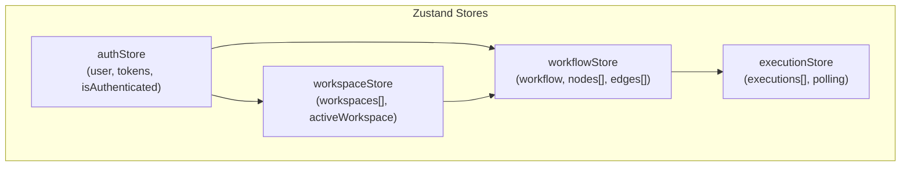
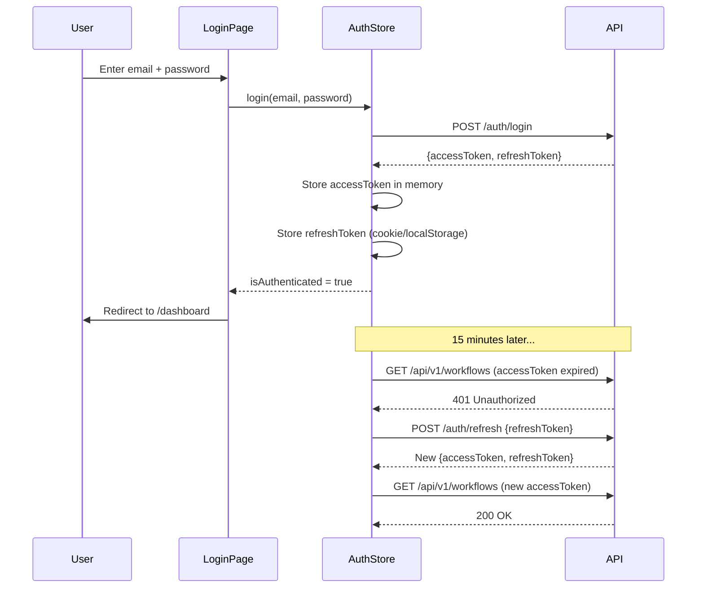

# Stargate Frontend

> React 18 application architecture, state management, and component design for the Stargate platform.

---

## Table of Contents

- [Overview](#overview)
- [Technology Stack](#technology-stack)
- [Application Structure](#application-structure)
- [State Management (Zustand)](#state-management-zustand)
- [Routing & Pages](#routing--pages)
- [Visual Workflow Builder (React Flow)](#visual-workflow-builder-react-flow)
- [API Client Layer](#api-client-layer)
- [Authentication Flow](#authentication-flow)
- [Key Components](#key-components)
- [Performance Considerations](#performance-considerations)

---

## Overview

The Stargate frontend is a **React 18 Single Page Application** built with Vite for development and bundled for production. It provides:

- A **dashboard** for workspace management, workflow listing, and observability
- A **visual workflow builder** with an infinite canvas, custom node types, and edge management
- A **real-time execution panel** showing live execution status and per-node output
- A **trigger management interface** for configuring manual, webhook, and cron triggers

In production, the SPA is served as static files via nginx.

---

## Technology Stack

| Library | Version | Purpose |
|---------|---------|---------|
| React | 18 | Component rendering and lifecycle |
| TypeScript | 5.0 | Type safety across all components |
| Vite | Latest | Dev server and production bundler |
| Zustand | Latest | Global state management |
| React Flow | Latest | Visual node/edge canvas |
| TailwindCSS | 3.x | Utility-first CSS framework |
| React Router | v6 | Client-side routing |

---

## Application Structure

```
apps/web/src/
├── App.tsx                 # Root component with router setup
├── main.tsx                # React DOM entry point
├── index.css               # Global styles and Tailwind imports
│
├── pages/
│   ├── Dashboard.tsx       # Main dashboard (workspaces, workflows, metrics)
│   ├── WorkflowDetail.tsx  # Full workflow builder + execution panel
│   ├── Login.tsx           # Authentication page
│   └── Register.tsx        # Registration page
│
├── components/
│   ├── nodes/              # Custom React Flow node types
│   ├── modals/             # Workspace/workflow/trigger modals
│   └── ui/                 # Shared UI primitives
│
├── store/
│   ├── authStore.ts        # Authentication state
│   ├── workspaceStore.ts   # Workspace management
│   ├── workflowStore.ts    # Workflow + canvas state
│   └── executionStore.ts   # Execution history and polling
│
└── lib/
    ├── api.ts              # HTTP client wrapper
    └── utils.ts            # Shared utilities
```

---

## State Management (Zustand)

Stargate uses **Zustand** for global state management. Zustand was chosen over Redux for its minimal boilerplate and ability to create composable, scoped stores without a Provider hierarchy.

### Store Architecture



### `authStore`
Manages the authenticated user session:
```typescript
interface AuthState {
  user: User | null;
  accessToken: string | null;
  isAuthenticated: boolean;
  login: (email: string, password: string) => Promise<void>;
  logout: () => Promise<void>;
  refreshToken: () => Promise<void>;
}
```

### `workspaceStore`
Manages workspace switching and CRUD:
```typescript
interface WorkspaceState {
  workspaces: Workspace[];
  activeWorkspace: Workspace | null;
  fetchWorkspaces: () => Promise<void>;
  createWorkspace: (name: string, description?: string) => Promise<Workspace>;
  setActiveWorkspace: (workspace: Workspace) => void;
}
```

### `workflowStore`
Manages the active workflow's graph state, synchronized with the React Flow canvas:
```typescript
interface WorkflowState {
  workflow: Workflow | null;
  nodes: ReactFlowNode[];         // React Flow format
  edges: ReactFlowEdge[];         // React Flow format
  selectedNode: ReactFlowNode | null;
  fetchWorkflow: (id: string) => Promise<void>;
  addNode: (type: string, position: XYPosition) => Promise<void>;
  updateNodeConfig: (id: string, config: NodeConfig) => Promise<void>;
  updateNodePosition: (id: string, position: XYPosition) => Promise<void>;
  deleteNode: (id: string) => Promise<void>;
  addEdge: (connection: Connection) => Promise<void>;
  deleteEdge: (id: string) => Promise<void>;
}
```

### `executionStore`
Manages execution history and real-time polling:
```typescript
interface ExecutionState {
  executions: WorkflowExecution[];
  activeExecution: WorkflowExecution | null;
  isPolling: boolean;
  fetchExecutions: (workflowId: string) => Promise<void>;
  triggerExecution: (workflowId: string) => Promise<void>;
  startPolling: (executionId: string) => void;
  stopPolling: () => void;
}
```

---

## Routing & Pages

### `Dashboard.tsx`
The primary view after authentication. Renders:
- **Workspace selector** — dropdown to switch active workspace
- **Workflow list** — all workflows in the active workspace with status indicators
- **Metrics panel** — success rate, total executions, average duration, failures
- **Recent executions** — global execution history across workflows

### `WorkflowDetail.tsx`
The core product experience. Contains:
- **React Flow canvas** — infinite pan/zoom canvas with custom nodes
- **Node configuration sidebar** — form panel for editing selected node config
- **Variables panel** — Available upstream output variables for `{{token}}` insertion
- **Trigger management panel** — Configure manual, webhook, and cron triggers
- **Execution history panel** — Per-execution timeline with node-level traces
- **Import/Export controls** — Serialize/deserialize workflow JSON

### `Login.tsx` / `Register.tsx`
Authentication pages with JWT-based session initialization. On successful login, the `authStore` stores the access token in memory and persists the refresh token.

---

## Visual Workflow Builder (React Flow)

The workflow canvas is built on **React Flow** — a highly customizable library for interactive node-based UIs.

### Custom Node Types

Stargate implements custom node renderers for each workflow node type:

```typescript
const nodeTypes = {
  HTTP: HTTPNode,    // Shows method badge, URL, and status indicator
  IF: IFNode,        // Shows expression and TRUE/FALSE edge handles
};
```

### Canvas Interactions

| Interaction | Behavior |
|------------|---------|
| Drag from palette | Creates new node at drop position, persisted to API |
| Click node | Opens configuration sidebar for that node |
| Drag node | Updates node position, debounced REST call to `PUT /nodes/:id/position` |
| Drag edge handle | Creates connection between nodes, persisted to `POST /edges` |
| Click edge | Selects edge for deletion or condition editing |
| Delete key | Deletes selected node or edge |

### State Synchronization
React Flow maintains its own internal state (node positions, edge connections) for rendering performance. The Zustand `workflowStore` acts as the persistence bridge — changes in React Flow trigger debounced API calls that persist the updated graph to PostgreSQL.

---

## API Client Layer

All API communication goes through a centralized fetch wrapper in `lib/api.ts` that:
1. Automatically attaches the `Authorization: Bearer <accessToken>` header
2. Handles `401 Unauthorized` responses by triggering token refresh
3. Serializes request bodies to JSON with the correct `Content-Type` header
4. Deserializes responses and surfaces errors with typed error objects

```typescript
// Usage in stores
const workflow = await api.get<Workflow>(`/workflows/${id}`);
const newWorkflow = await api.post<Workflow>('/workflows/workspace/:id', { name });
```

---

## Authentication Flow



---

## Key Components

### Node Configuration Sidebar
The sidebar renders dynamically based on the selected node type:
- **HTTP nodes:** URL field, method selector, headers key-value editor, JSON body editor
- **IF nodes:** Expression input with syntax hint, available variables reference

### Available Variables Panel
A helper panel in the sidebar shows all upstream node outputs that are available for `{{variable}}` insertion:
```
Available from "Fetch User" node:
  {{fetchUser.body.id}}
  {{fetchUser.body.email}}
  {{fetchUser.status}}
```
Clicking a variable copies its token to the clipboard for paste into configuration fields.

### Execution Timeline
Renders the full execution trace as an interactive list:
- Collapsible per-node entries showing status, duration badge, and output JSON
- Color-coded status indicators (green/red/yellow/gray for SUCCESS/FAILED/RUNNING/SKIPPED)
- `SLOW` warning badge for nodes exceeding 5,000ms

---

## Performance Considerations

### Current State
- Zustand store updates trigger re-renders in all subscribed components
- React Flow canvas updates are generally efficient (internal virtualization)
- Execution polling runs every 2 seconds while an active execution is detected

### Known Optimization Opportunities
1. **Scoped Zustand selectors** — Components should use granular selectors (e.g., `useWorkflowStore(s => s.nodes)`) instead of selecting the entire store object, to prevent unnecessary re-renders
2. **Node drag debouncing** — Position updates during drag are debounced but could be further optimized to only persist on drag end
3. **Execution polling** — The 2-second interval polling could be replaced with Server-Sent Events for push-based updates
