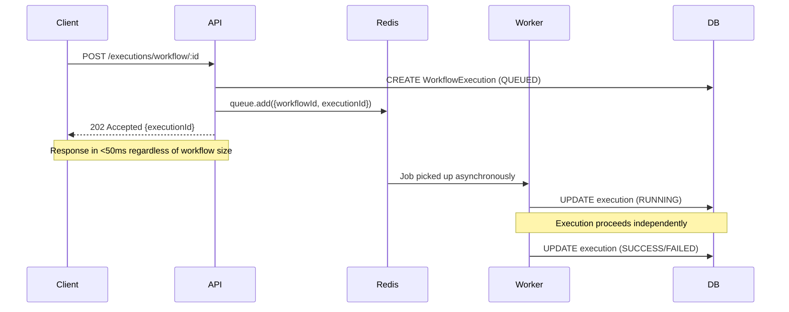
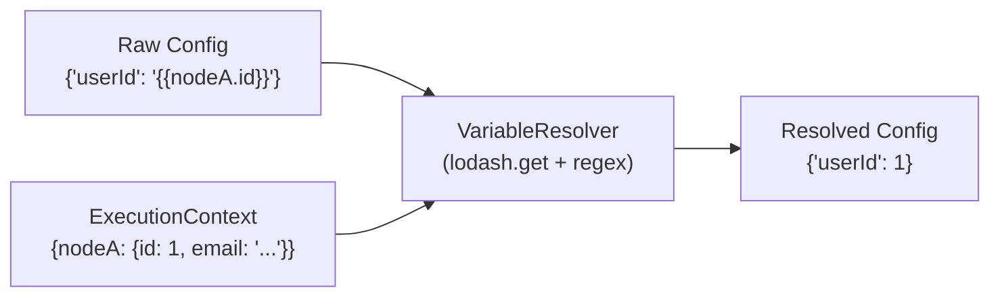
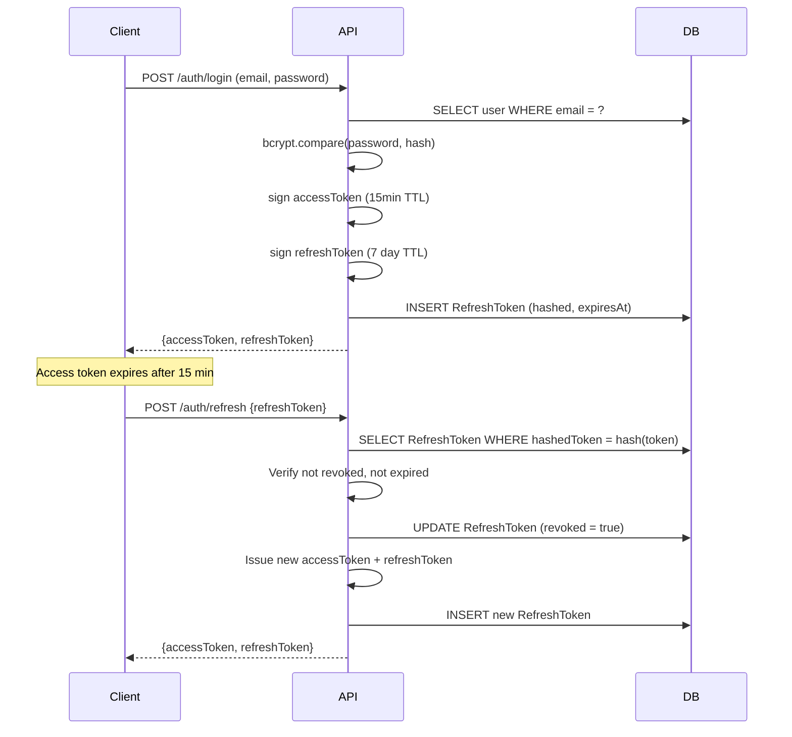
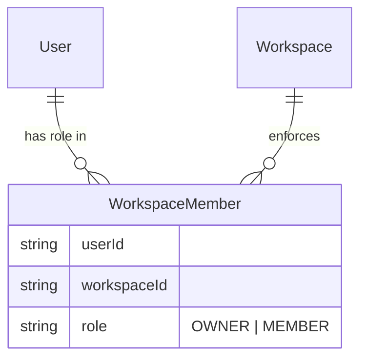

# Stargate System Design

> Engineering decisions, trade-offs, and system design rationale for the Stargate platform.

---

## Table of Contents

- [Core Problem & Design Goals](#core-problem--design-goals)
- [The Async Execution Model](#the-async-execution-model)
- [DAG Execution Engine Design](#dag-execution-engine-design)
- [Variable Resolution System](#variable-resolution-system)
- [Conditional Branching Design](#conditional-branching-design)
- [Authentication System Design](#authentication-system-design)
- [Workspace Isolation Model](#workspace-isolation-model)
- [Import/Export System Design](#importexport-system-design)
- [Scalability Considerations](#scalability-considerations)
- [Known Trade-offs & Technical Debt](#known-trade-offs--technical-debt)

---

## Core Problem & Design Goals

A workflow orchestrator needs to solve several competing constraints simultaneously:

| Constraint | Requirement |
|-----------|-------------|
| **Responsiveness** | API must return immediately — never wait for workflow to finish |
| **Correctness** | Nodes must execute in dependency order, never before their inputs are ready |
| **Resilience** | Server crashes must not lose in-progress work |
| **Observability** | Every step must be traceable with inputs, outputs, and timing |
| **Safety** | Users cannot weaponize the executor against internal infrastructure |
| **Expressiveness** | Users must be able to define conditional logic and pass data between steps |

These requirements drive the core architectural decisions described below.

---

## The Async Execution Model

### The Problem
A workflow might make 10 sequential HTTP requests, each taking 1–2 seconds. Synchronous execution would:
- Block the API thread for up to 20 seconds per request
- Make it impossible to handle concurrent dashboard refreshes or new triggers
- Create timeout cascades in reverse-proxies and load balancers
- Lose all work if the API process restarts mid-execution

### The Solution: Queue-Based Delegation



The client receives a `202 Accepted` with an `executionId` — it can then poll `GET /executions/:executionId` to observe progress. The API's p99 latency for triggering a workflow is independent of the workflow's complexity.

### BullMQ as the Queue Substrate
BullMQ was chosen over in-memory alternatives (e.g., simple event emitters) because:
1. **Persistence** — Jobs survive process restarts
2. **Locking** — BullMQ prevents concurrent processing of the same job
3. **Retry mechanics** — Built-in exponential backoff with configurable attempts
4. **Dead letter handling** — Failed jobs are captured for inspection, not silently dropped
5. **Job visibility** — Job state (waiting, active, completed, failed) is queryable

---

## DAG Execution Engine Design

### Representing Workflows as DAGs
Workflows are stored as a set of `Node` and `Edge` records in PostgreSQL. An `Edge` connects a `sourceNodeId` to a `targetNodeId` with an optional `condition` string. This forms a **Directed Acyclic Graph** (acyclic enforced at API level via cycle detection).

### Topological Sort (Kahn's Algorithm)
The Worker uses **Kahn's BFS-based topological sort** to determine execution order:

```
1. Build in-degree map: for each node, count incoming edges
2. Build adjacency list: for each edge, map source → [edges]
3. Initialize queue with all nodes having in-degree 0 (root nodes)
4. Process queue: for each node, reduce in-degree of all successors
5. If successor's in-degree reaches 0, add to queue
6. Result: sorted order respects all dependency relationships
```

This handles complex topologies including:
- **Linear chains:** A → B → C
- **Fan-out:** A → B, A → C (B and C can execute after A)
- **Fan-in:** A → C, B → C (C executes only after both A and B complete)
- **Diamond patterns:** A → B → D, A → C → D

### Cycle Detection
The API validates the graph before enqueueing any job. Topological sort is performed; if `sorted.length !== nodes.length`, a cycle exists and the request is rejected with a `400 Bad Request`.

### Execution State Machine
Each node and workflow tracks state through a deterministic state machine:

```
WorkflowExecution: QUEUED → RUNNING → SUCCESS | FAILED
NodeExecution:     PENDING → RUNNING → SUCCESS | FAILED | SKIPPED
```

The SKIPPED state is the key innovation: rather than failing the whole workflow when a conditional branch doesn't apply, downstream nodes of failed conditions are gracefully bypassed.

---

## Variable Resolution System

### The Problem
Consider a two-node workflow:
1. `GET https://api.example.com/users/1` → returns `{"id": 1, "email": "user@example.com"}`
2. `POST https://api.example.com/notify` with body `{"userId": ???}`

The user needs a way to pass `1` (from node 1's output) into node 2's request body, without hardcoding it.

### The Solution: Double-Curly-Brace Templating

Users write node configurations with template tokens:
```json
{
  "url": "https://api.example.com/notify",
  "body": {
    "userId": "{{nodeA.id}}",
    "email": "{{nodeA.email}}"
  }
}
```

The `VariableResolver` processes these before execution:



### Implementation Details
- **Pattern:** `{{[\w$.-]+}}` — captures dot-notation paths
- **Lookup:** `lodash.get(context, path)` — safely traverses nested objects
- **Type preservation:** Numbers, booleans, and objects are preserved; `undefined` values resolve to empty string (preventing `"undefined"` in URLs)
- **Deep resolution:** Arrays and nested objects are recursively resolved

### Execution Context Structure
```typescript
// Built as nodes complete
const executionContext: Record<string, any> = {
  "node-uuid-1": {
    url: "https://api.example.com/users/1",
    status: 200,
    body: { id: 1, email: "user@example.com" },
    durationMs: 142
  },
  // ... more nodes as they complete
};
```

---

## Conditional Branching Design

### IF Node Semantics
An `IF` node evaluates a JavaScript-style boolean expression against the current execution context. The node outputs `{ result: true | false }`.

Downstream edges from an `IF` node carry a `condition` value of either `"TRUE"` or `"FALSE"`. The Worker evaluates each outgoing edge's condition after the node completes:
- Edges with matching conditions → `edgeState = true` → target nodes execute
- Edges with non-matching conditions → `edgeState = false` → target nodes are skipped

### Expression Evaluation via jexl
The `jexl` library provides a sandboxed JavaScript expression evaluator. Expressions like:
```
response.status === 200
previousNode.body.count > 0
response.status >= 200 && response.status < 300
```
...are evaluated safely without `eval()` or Function constructors.

### Branch Pruning Algorithm
When a node is skipped, all outgoing edges from that node are automatically set to `false`:

```typescript
if (!shouldExecute) {
  await markNodeSkipped(nodeExecution.id);
  // Propagate skip to all downstream edges
  for (const edge of outgoingEdges) {
    edgeState.set(edge.id, false);
  }
  continue;
}
```

Because the topological sort guarantees we process nodes in dependency order, by the time we reach any downstream node, all its incoming edges have already been evaluated — so the `shouldExecute` check correctly reflects whether *any* valid path reached this node.

---

## Authentication System Design

### JWT + Refresh Token Strategy



### Security Properties
- **Access tokens** are short-lived (15 minutes) — exposure window is minimal
- **Refresh tokens** are stored **hashed** in PostgreSQL — database breach doesn't expose tokens
- **Refresh token rotation** — each use revokes the old token and issues a new one
- **Cascade deletion** — when a user is deleted, all their refresh tokens are cascade-deleted

---

## Workspace Isolation Model

### RBAC Architecture
Authorization is **scoped per workspace**, not globally. A user can be an `OWNER` in one workspace and a `MEMBER` in another.



### Enforcement Points
Every mutating operation on workspace-scoped resources (workflows, nodes, edges, triggers, executions) goes through an authorization middleware that:
1. Extracts `userId` from the validated JWT
2. Queries `WorkspaceMember` for `(userId, workspaceId)` pair
3. Rejects with `403 Forbidden` if no record exists or role is insufficient

### Atomic Workspace Creation
Creating a workspace uses a Prisma `$transaction` to atomically create both records:
```typescript
await prisma.$transaction([
  prisma.workspace.create({ data: { name, createdById: userId } }),
  prisma.workspaceMember.create({ data: { userId, workspaceId, role: 'OWNER' } })
]);
```
If either operation fails, both roll back — preventing orphaned workspaces with no owner.

---

## Import/Export System Design

### Export
The export endpoint serializes a workflow into a self-contained JSON document:
```json
{
  "name": "Workflow Name",
  "description": "...",
  "nodes": [...],
  "edges": [...],
  "triggers": [...]
}
```

### Import (UUID Remapping)
The critical challenge: imported nodes/edges have UUIDs from the source environment. These must be regenerated to avoid collisions.

The Import controller uses an in-memory `Map<oldId, newId>` to remap all references:

```typescript
const idMap = new Map<string, string>();

// First pass: create new IDs for all nodes
for (const node of importedData.nodes) {
  idMap.set(node.id, uuid());
}

// Second pass: create edges with remapped IDs
for (const edge of importedData.edges) {
  await prisma.edge.create({
    data: {
      id: uuid(),
      sourceNodeId: idMap.get(edge.sourceNodeId)!, // Remapped
      targetNodeId: idMap.get(edge.targetNodeId)!, // Remapped
      workflowId: newWorkflowId,
    }
  });
}
```

This preserves the full topology while generating new unique identifiers safe for the target workspace.

---

## Scalability Considerations

### Current Architecture Limits
| Dimension | Current State | Scaling Path |
|-----------|--------------|--------------|
| Worker processes | 1 process | Horizontal: run multiple `worker` containers sharing the same Redis queue |
| Queue isolation | Single global queue | Per-workspace queues with BullMQ queue groups |
| Database connections | Single Prisma client per service | Connection pooling via PgBouncer |
| Execution polling | Client-side polling every 2s | WebSocket push via Redis Pub/Sub |

### Horizontal Worker Scaling
Because jobs are queued in Redis and BullMQ uses distributed locking, multiple Worker containers can safely process jobs concurrently:
```bash
docker compose up --scale worker=3
```
BullMQ ensures each job is processed by exactly one worker, even under concurrent access.

---

## Known Trade-offs & Technical Debt

| Trade-off | Current Decision | Future Path |
|-----------|-----------------|-------------|
| **Polling vs WebSockets** | Client polls execution status | Redis Pub/Sub → Server-Sent Events |
| **Single queue** | All workspaces share one BullMQ queue | Per-workspace queues for isolation |
| **Node type extensibility** | HTTP and IF nodes hardcoded in worker | Plugin architecture with `integrations/` folder |
| **UI render performance** | Full Zustand store updates on node drag | Scoped selectors to prevent cascade re-renders |
| **Shared worker pool** | All tenant executions compete for same worker | Tiered worker pools per workspace plan |
| **Canvas state sync** | Debounced REST on every drag | Canvas-native persistence with conflict resolution |
