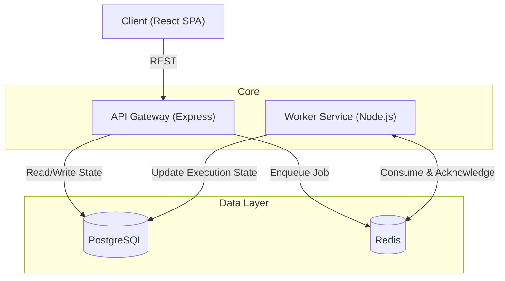
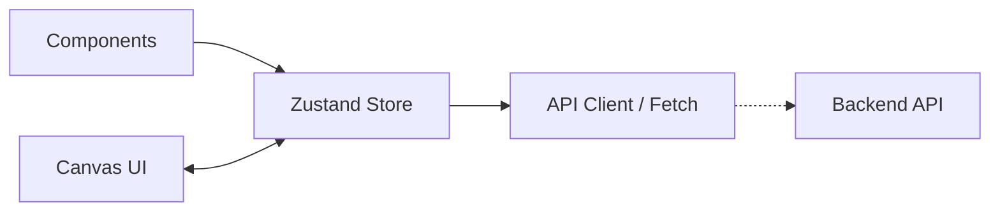
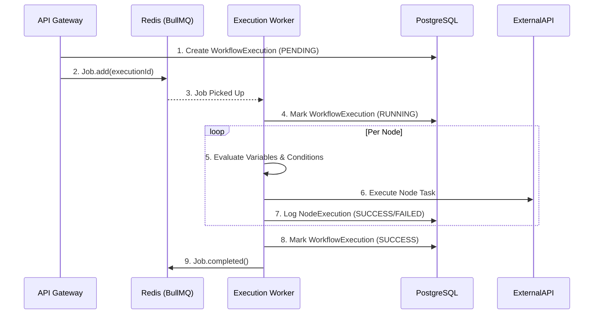
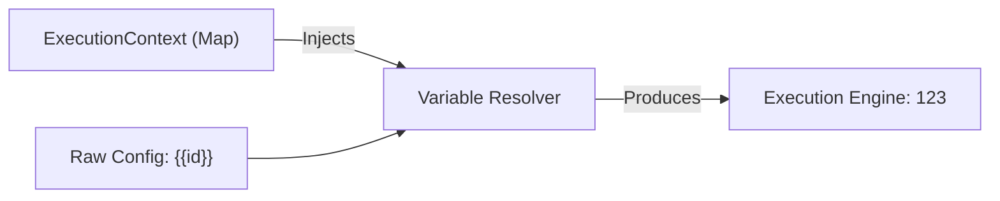
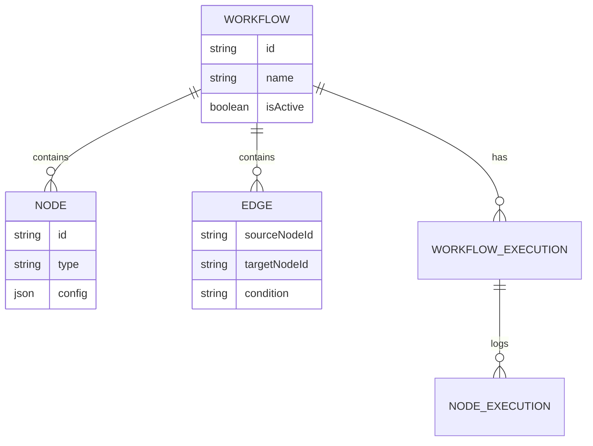

# Stargate Architecture

This document describes the high-level system design, data flow, and microservice responsibilities of the Stargate platform.

---

## High-Level Architecture

Stargate is built on a scalable, decoupled architecture where the API Gateway and the Execution Worker operate as independent microservices. They communicate asynchronously via a Redis-backed message queue, while sharing state through a centralized PostgreSQL database.

---

## Frontend Architecture
**Tech Stack:** React, TypeScript, Zustand, React Flow, Vite, TailwindCSS

The frontend serves as the presentation layer. It manages the visual canvas state locally using `React Flow` and synchronizes structurally with the backend using debounced REST requests.

- **Zustand** is utilized for lightweight global state (Auth, Workspaces, Workflows, Execution Polling).
- **React Flow** manages node positions, edge connections, and canvas pan/zoom interactions.

---

## Backend Architecture (API Gateway)
**Tech Stack:** Express.js, TypeScript, Prisma ORM, Zod

The API Gateway is responsible for CRUD operations, authentication, webhook ingestion, and workflow validation. It does *not* execute workflows synchronously.

**Key Responsibilities:**
1. Validating acyclic graphs (Topological Sort).
2. Authenticating users via JWT and RBAC.
3. Managing Prisma schema mappings.
4. Enqueueing verified workflow executions to BullMQ.

---

## Worker Architecture (Execution Engine)
**Tech Stack:** BullMQ, Node.js, `jexl`, `lodash`

The Worker is a headless background process that constantly polls Redis for jobs.

**Key Responsibilities:**
1. Hydrating workflow graphs from PostgreSQL.
2. Managing the `ExecutionContext` (Variable Interpolation).
3. Routing execution based on edge conditionals.
4. Executing raw HTTP network requests safely.
5. Updating `WorkflowExecution` and `NodeExecution` statuses in real-time.

---

## Redis / BullMQ Data Flow

---

## Branching Logic & Variable Resolution Flow

### Conditional Branching (DAG Routing)
Workflows are represented as Directed Acyclic Graphs (DAGs). When a node completes, the worker evaluates outgoing edges.
If the edge contains a `condition` (e.g., `status === 200`), the worker evaluates it against the Node's output.
- **TRUE:** The target node is added to the execution queue.
- **FALSE:** The target node, and all subsequent children exclusively attached to it, are marked `SKIPPED`.

### Variable Resolution
Before evaluating conditions or executing an HTTP node, the worker runs the `VariableResolver`.
It scans the node's `config` (URLs, headers, JSON body) for interpolation markers: `{{node123.body.userId}}`.
It replaces these tokens natively by querying the hydrated `ExecutionContext` (a Map of all previously completed node outputs in the current workflow instance).

---

## Database Schema (Abridged)

