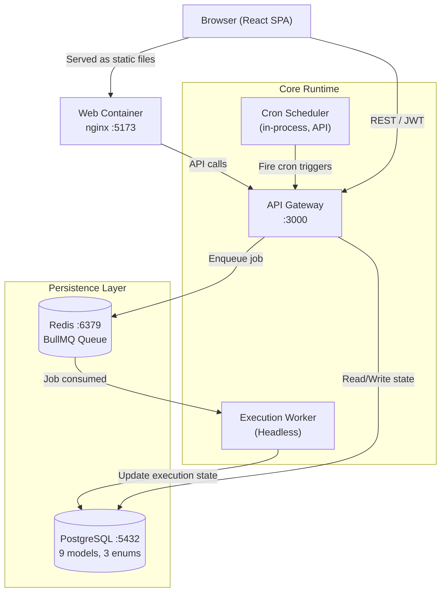
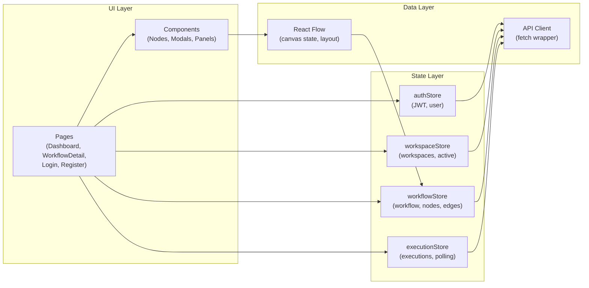
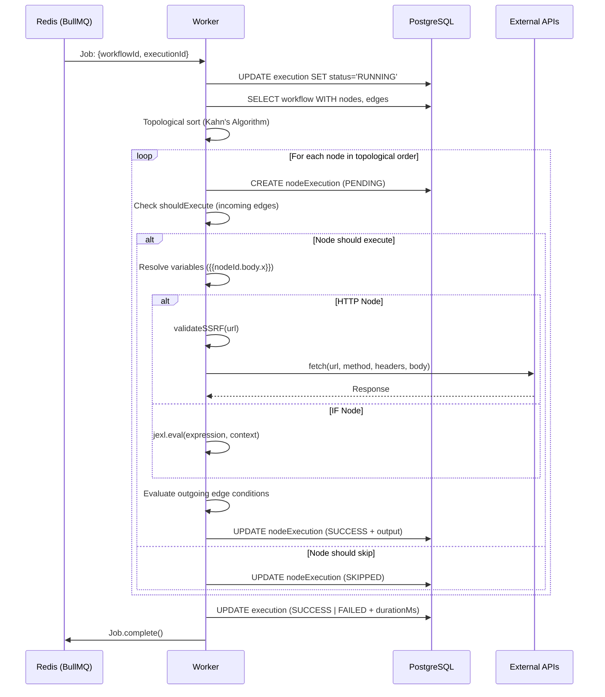
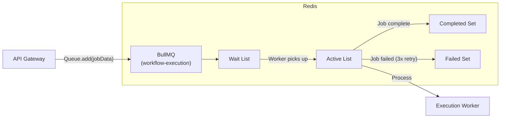
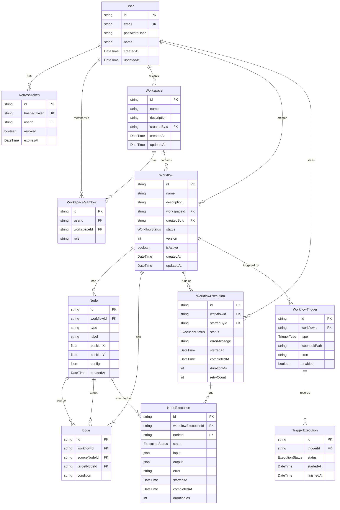
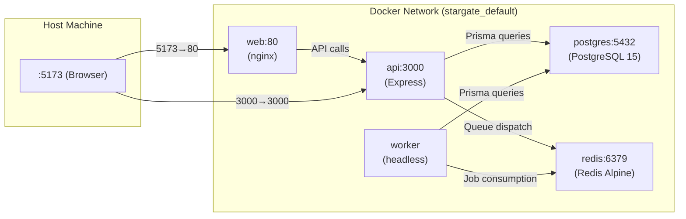

# Stargate Architecture

> Deep-dive technical architecture for the Stargate workflow orchestration platform.

---

## Table of Contents

- [Overview](#overview)
- [Service Topology](#service-topology)
- [Frontend Architecture](#frontend-architecture)
- [API Gateway Architecture](#api-gateway-architecture)
- [Worker Architecture](#worker-architecture)
- [Queue Architecture (Redis + BullMQ)](#queue-architecture-redis--bullmq)
- [Database Architecture](#database-architecture)
- [Network & Container Topology](#network--container-topology)
- [Key Architectural Decisions](#key-architectural-decisions)

---

## Overview

Stargate is a **polyglot microservice monorepo** orchestrated with Turborepo and containerized via Docker Compose. The system separates concerns across three distinct runtime processes:

| Service | Role | Technology |
|---------|------|-----------|
| `apps/api` | HTTP gateway, auth, CRUD, job dispatch | Express.js, TypeScript, Prisma |
| `apps/worker` | Async workflow execution | Node.js, BullMQ, jexl |
| `apps/web` | Interactive visual frontend | React 18, Vite, React Flow, Zustand |

These services communicate via:
- **REST API** (Client ↔ API)
- **Redis Queue** (API → Worker via BullMQ)
- **PostgreSQL** (API ↔ DB, Worker ↔ DB)

The key invariant: **the API Gateway never executes workflow logic synchronously**. All execution is delegated to the Worker via the queue.

---

## Service Topology



---

## Frontend Architecture

**Stack:** React 18, TypeScript, Vite, Zustand, React Flow, TailwindCSS

The frontend is a **Single Page Application** (SPA) served via nginx in production and Vite's dev server locally. It communicates exclusively with the API Gateway over REST.



### State Architecture
- **Zustand** stores are the single source of truth for all application state.
- Canvas-related state (node positions, edges in flight) is managed inside React Flow's internal state, and synced to the backend via debounced REST calls on change.
- JWT refresh token rotation is handled automatically in the API client layer.

### Pages
| Page | Purpose |
|------|---------|
| `Login` / `Register` | Authentication with JWT token storage; split-panel layout (features left, form right) |
| `Dashboard` | Workspace management, KPI strip, workflow list with run-history dots, activity feed |
| `WorkflowDetail` | Full React Flow canvas, node config modals, trigger management, resizable execution panel |

### Key Components
| Component | Purpose |
|-----------|---------|
| `CommandPalette` | `⌘K` fuzzy search across workflows and actions, keyboard-navigable |
| `KpiStrip` | 4 live metrics with SVG sparkline trends |
| `ActivityFeed` | Cross-workflow execution history grouped by Today/Yesterday/Older |
| `CustomNode` | ReactFlow node with animated RUNNING glow ring and status badges |
| `ResizablePanel` | Drag-to-resize bottom panel, height persisted to `localStorage` |
| `CanvasStatusBar` | Floating node/edge count chip on the canvas |
| `ExecutionDetailModal` | Per-node timeline, expandable response bodies, copy buttons |

---

## API Gateway Architecture

**Stack:** Express.js, TypeScript, Prisma ORM, Zod, BullMQ, Helmet, Morgan

The API Gateway is a stateless REST service responsible for:
1. **Authentication** — JWT validation, refresh token management
2. **Authorization** — Per-workspace RBAC enforcement
3. **CRUD** — Full lifecycle management of Workspaces, Workflows, Nodes, Edges, Triggers
4. **Graph Validation** — Cycle detection via topological sort before job dispatch
5. **Job Dispatch** — Creating `WorkflowExecution` records and enqueuing to BullMQ
6. **Webhook Ingestion** — Public endpoint for inbound trigger payloads
7. **Observability** — Metrics aggregation and system health endpoints

### Route Map

```
POST   /api/v1/auth/register
POST   /api/v1/auth/login
POST   /api/v1/auth/refresh
POST   /api/v1/auth/logout
GET    /api/v1/users/me

POST   /api/v1/workspaces
GET    /api/v1/workspaces
GET    /api/v1/workspaces/:id
PUT    /api/v1/workspaces/:id
DELETE /api/v1/workspaces/:id

POST   /api/v1/workflows/workspace/:workspaceId
GET    /api/v1/workflows/workspace/:workspaceId
GET    /api/v1/workflows/:id
PUT    /api/v1/workflows/:id
DELETE /api/v1/workflows/:id
GET    /api/v1/workflows/:id/graph
GET    /api/v1/workflows/:id/export
POST   /api/v1/workflows/workspace/:workspaceId/import

POST   /api/v1/nodes/workflow/:workflowId
PUT    /api/v1/nodes/:id
PUT    /api/v1/nodes/:id/position
DELETE /api/v1/nodes/:id

POST   /api/v1/edges/workflow/:workflowId
DELETE /api/v1/edges/:id

POST   /api/v1/workflows/:id/executions      (trigger execution)
GET    /api/v1/workflows/:id/executions      (list executions)
GET    /api/v1/executions/:executionId        (get execution detail)

POST   /api/v1/workflows/:workflowId/triggers
GET    /api/v1/workflows/:workflowId/triggers
PUT    /api/v1/triggers/:id
DELETE /api/v1/triggers/:id

POST   /api/v1/webhooks/:webhookPath          (inbound webhook)

GET    /api/v1/system/metrics/workspace/:workspaceId
GET    /api/v1/system/health

GET    /health                                 (root health check)
```

---

## Worker Architecture

**Stack:** Node.js, BullMQ, Prisma, jexl, lodash

The Worker is a **headless background process** — no HTTP server, no UI. It connects to Redis and listens for jobs on the `workflow-execution` queue.

### Job Processing Pipeline



### Reliability Features
- **3 automatic retries** with exponential backoff (BullMQ native)
- **5-minute global timeout** via `Promise.race` wrapping the entire execution
- **Graceful failure** — failed nodes don't crash the worker; error is persisted and other independent branches continue

---

## Queue Architecture (Redis + BullMQ)



### BullMQ Configuration
| Setting | Value | Purpose |
|---------|-------|---------|
| Queue name | `workflow-execution` | Single global queue for all executions |
| Max retries | 3 | Resilience against transient errors |
| Retry strategy | Exponential backoff | Avoids thundering herd on dependency recovery |
| Job data | `{workflowId, executionId, triggerExecutionId?}` | Minimal payload; worker fetches full graph from DB |

---

## Database Architecture

**Stack:** PostgreSQL 15, Prisma ORM

### Full Entity-Relationship Diagram



### Enum Definitions

**`ExecutionStatus`:** `QUEUED` | `PENDING` | `RUNNING` | `SUCCESS` | `FAILED` | `SKIPPED`

**`TriggerType`:** `MANUAL` | `WEBHOOK` | `SCHEDULE`

**`WorkflowStatus`:** `DRAFT` | `ACTIVE`

---

## Network & Container Topology



### Port Mapping
| Service | Host Port | Container Port |
|---------|-----------|---------------|
| Web (nginx) | 5173 | 80 |
| API (Express) | 3000 | 3000 |
| PostgreSQL | 5433 | 5432 |
| Redis | 6379 | 6379 |
| Worker | — | — (no HTTP exposure) |

---

## Key Architectural Decisions

### Why Not WebSockets for Execution Updates?
The current implementation uses **polling** from the frontend to check execution status. This was a deliberate simplicity trade-off. WebSockets would require a pub/sub layer (Redis Pub/Sub or Socket.io with Redis adapter) to broadcast from Worker to the API and then to connected clients — adding significant complexity. Polling at 2-second intervals is sufficient for the current use case.

### Why a Single Global Queue vs. Per-Workspace Queues?
A single `workflow-execution` queue was chosen for simplicity. The known trade-off is **noisy-neighbor behavior**: a workspace running many large workflows could starve others. Per-workspace queues with rate limiting is the planned production evolution.

### Why Prisma ORM?
Prisma provides compile-time type safety for all database queries, automatic migration management, and a schema-as-code model that makes the data model immediately readable to any engineer. The trade-off is slightly less control over raw SQL for complex queries — acceptable given the current query patterns.

### Why Turborepo?
The monorepo structure allows `@stargate/database` and `@stargate/shared` to be imported directly by both the API and Worker with proper TypeScript resolution, avoiding code duplication and ensuring type consistency across all Prisma queries.
